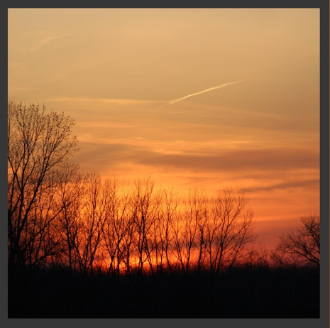

# Sliced Bread: The band
---
So my interest in music that I mentioned earlier is through the outlet of the band I play in: Sliced Bread.
The closest genre I can give you is indie/alt rock, which encompasses a lot of things but so do we. 

We have only have one single out at the moment, but if you want to hear what we've done so far you can find us on all streaming services, like [Spotify](https://open.spotify.com/artist/4KQl4ZFqc9JQOlGmv76Xmv?si=qHuCCfqDTLWBg_KofFX1uw) for example.

I play bass guitar for Sliced Bread, which was something I never expected to have skill in. 
I wasn't honestly all that interested in music until a couple years ago, but because they were all close friends of mine they just asked me if I wanted to pick up bass and play with them.
So naturally, that's exactly what I did a little over a year ago and now here we are. 

#### Some of my biggest inspirations in music:
(Basically this is just me putting you on some bands you've prolly never heard of)
- [The Wrecks](https://open.spotify.com/artist/458aS6ALc3QkzwfR5USt34?si=QpLonp8zRDGe_R3-H4T1_A)
- [The Blue Stones](https://open.spotify.com/artist/5VPCIIfZPK8KPsgz4jmOEC?si=_t6sD8yvTRazq8-DBpULPw)
- [Des Rocs](https://open.spotify.com/artist/2kO6mP0olFJGGh6kvUdNC8?si=L40DXZVTRtexWB9ARKirxg)
- [The Technicolors](https://open.spotify.com/artist/6hQS54VPpxunuwR0W7usuo?si=41gDSOorQCyVn8BKYb7Spw)
- [Kaleo](https://open.spotify.com/artist/7jdFEYD2LTYjfwxOdlVjmc?si=JLYoN-ZcS32a-9oVlC6U4Q)
- [Jet Black Alley Cat](https://open.spotify.com/artist/6p2LDcKxYGWM4azuOXNPHJ?si=Z_vqRG7FTu-fBLuCcXSlIQ)
- [Young the Giant](https://open.spotify.com/artist/4j56EQDQu5XnL7R3E9iFJT?si=jlBpFnqyRo-4KwnxZ5uKKw)
- [Tipling Rock](https://open.spotify.com/artist/2ZDHVJnLtH2KJfBFzShihr?si=uptc2SrkS5ybiTHh-2kQhQ)
